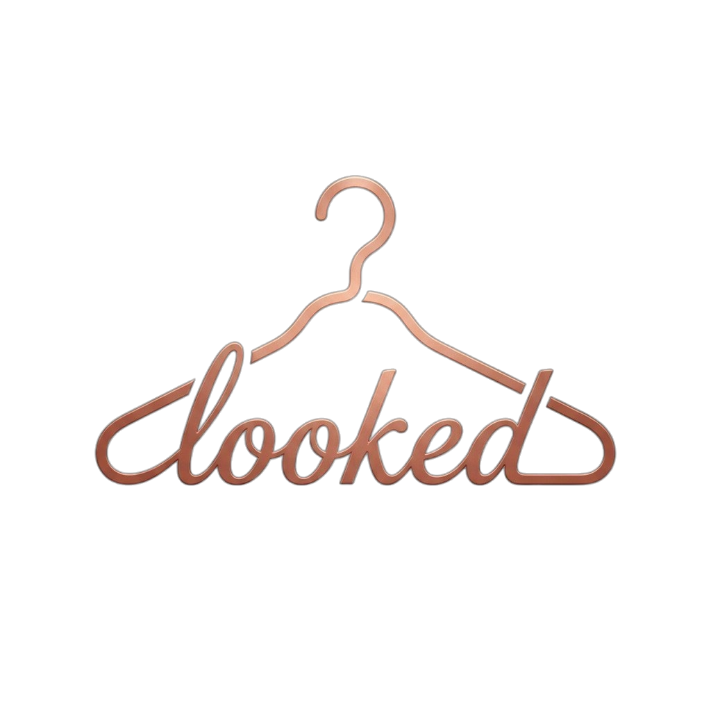
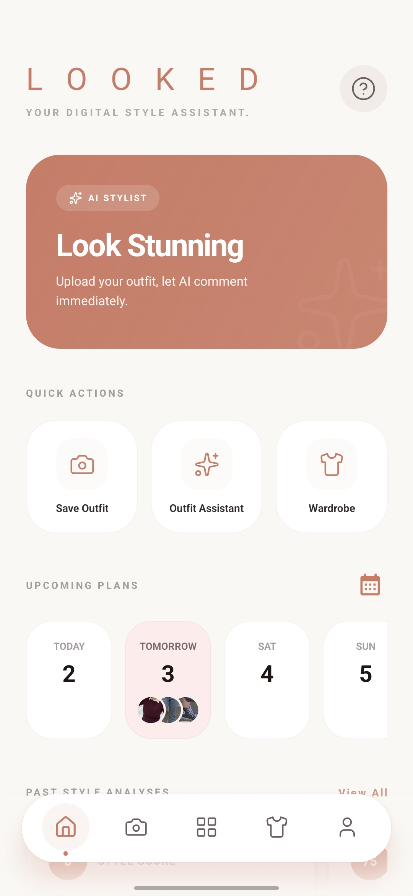
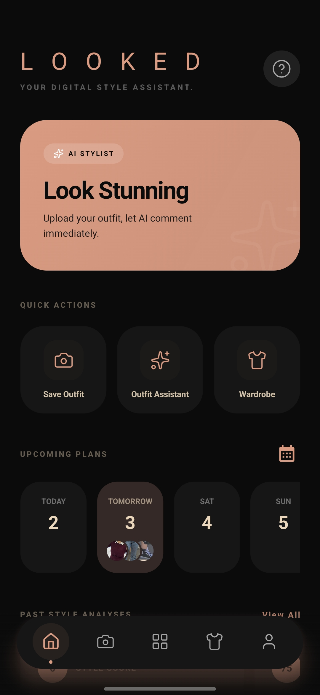
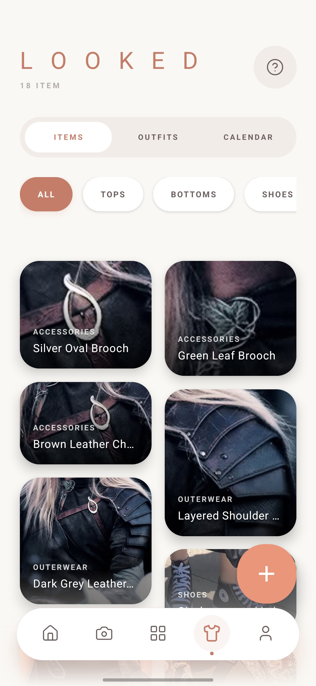
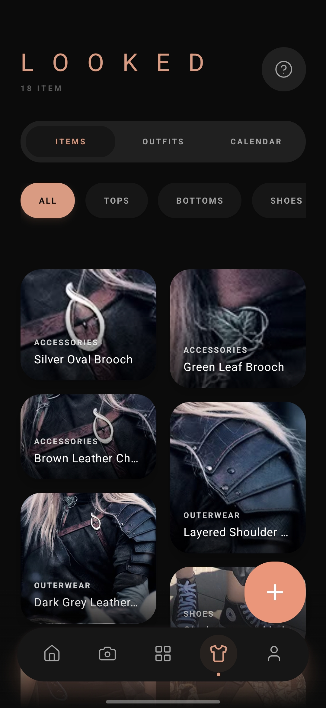
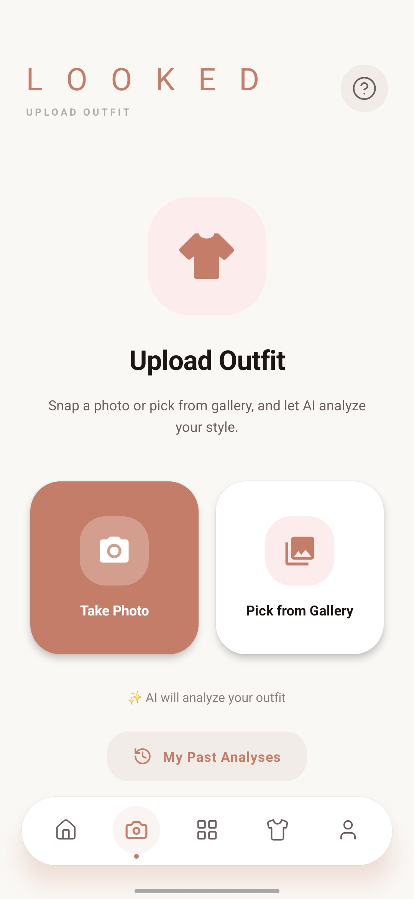
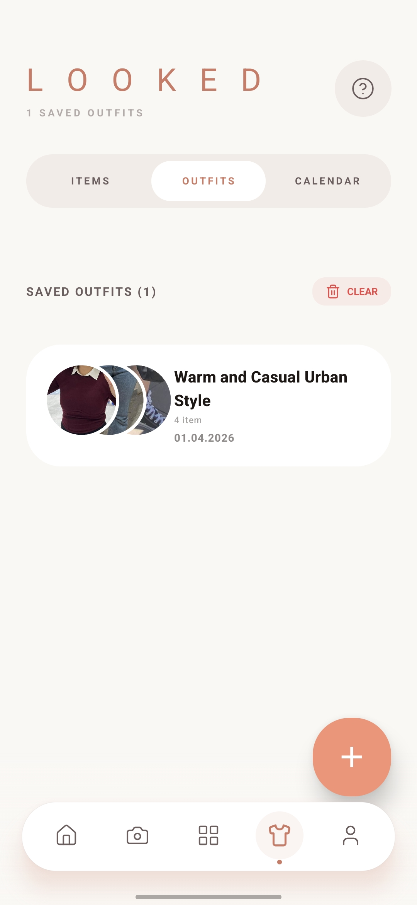
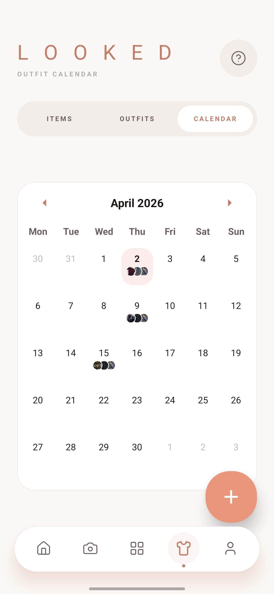
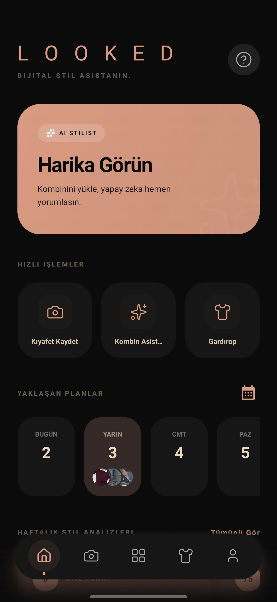
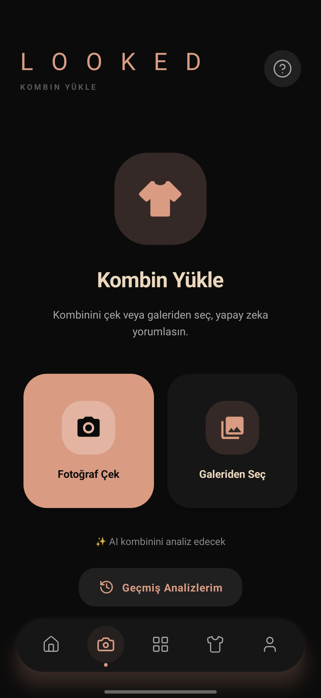

<div align="center">

<br/>



<br/><br/>

### Your Personal AI-Powered Digital Wardrobe

[](https://reactnative.dev/)
[](https://expo.dev/)
[](https://firebase.google.com/)
[](https://ai.google.dev/)
[](https://www.typescriptlang.org/)
[](https://opensource.org/licenses/MIT)

<br/>

[](https://play.google.com/store/apps/details?id=com.egebo.looked&hl=tr)

<br/>

> **This repository is a public architecture & UI showcase.**
> Some proprietary production logic is kept private to protect the commercial integrity of the live version.

<br/>

*"Where Fashion Meets Technology"*

</div>

---

## 📱 Screenshots

<div align="center">

| Home — Light | Home — Dark | Wardrobe |
|:---:|:---:|:---:|
|  |  |  |

| Wardrobe — Dark | Upload Outfit | Outfits |
|:---:|:---:|:---:|
|  |  |  |

| Calendar | Outfits — Dark | Calendar — Dark |
|:---:|:---:|:---:|
|  |  |  |

</div>

---

## ✨ Features

### 👕 Smart Wardrobe Management
- **AI Auto-Tagging** — Gemini 2.5 Flash identifies and categorizes items automatically from photos
- **Background Removal** — High-precision automated background removal for clean item thumbnails
- **Category Filtering** — Browse by Tops, Bottoms, Shoes, Accessories, and more
- **Digital Cataloging** — Every piece in your closet, searchable and organized

### 🧙 AI Style Consulting
- **Outfit Analysis** — Upload any outfit and receive an instant style score (0–100) with professional feedback
- **AI Outfit Generator** — Auto-generate outfit combinations from your wardrobe tailored to any occasion (Casual, Office, Wedding, etc.)
- **Harmony Check** — Validate if multiple items work well together before stepping out

### 📅 Outfit Calendar
- **Plan Ahead** — Schedule outfits for upcoming days
- **Style History** — Review what you wore and when

### 🌗 Full Bilingual & Theming Support
- **Turkish / English** — All UI strings and AI responses are fully bilingual
- **Light & Dark Mode** — Seamless Material Design 3 theming with a curated Terracotta–Sage–Champagne palette

---

## 🛠 Tech Stack

| Layer | Technology |
|---|---|
| **Framework** | React Native + Expo Router (file-based routing) |
| **Language** | TypeScript |
| **UI Library** | React Native Paper (Material Design 3) |
| **AI Engine** | Google Gemini 2.5 Flash |
| **Auth** | Firebase Authentication (Email + Google Sign-In) |
| **Database** | Cloud Firestore |
| **Storage** | Firebase Storage |
| **State** | React Context API (Auth, Theme, Language, UserProfile) |
| **i18n** | i18next |
| **Build & Deploy** | Expo Application Services (EAS) |

---

## 🏗 Architecture Overview

```
app/
├── _layout.tsx          # Root: AuthProvider → LanguageProvider → ThemeProvider → UserProfileProvider
├── auth/                # Login, Register screens
└── (tabs)/              # Main app — floating bottom bar navigation
    ├── index.tsx        # Home dashboard
    ├── camera.tsx       # Upload & AI analysis
    ├── wardrobe.tsx     # Digital wardrobe (Items / Outfits / Calendar)
    └── profile.tsx      # User profile & settings

services/
├── ai.ts                # All Gemini calls: analyzeOutfit(), suggestOutfitCombination(), autoCreateOutfit()
├── storage.ts           # Firestore + Firebase Storage operations
└── firebase.ts          # Firebase singleton initialization

context/
├── AuthContext          # Firebase Auth state + async persistence
├── UserProfileContext   # Firestore user profile
├── ThemeContext         # Light/Dark preference (AsyncStorage)
└── LanguageContext      # TR/EN preference (AsyncStorage)

constants/
├── Theme.ts             # MD3 light & dark theme definitions
└── translations/        # en.json, tr.json
```

---

<div align="center">

Developed by **Egemen Bozca**

</div>
